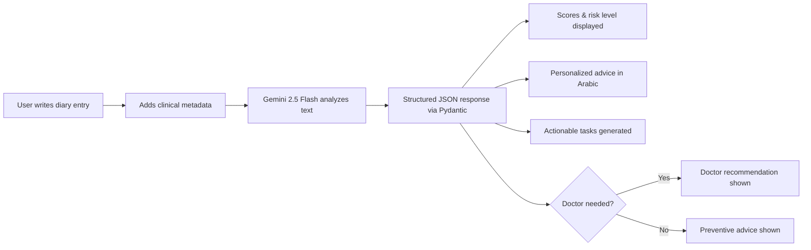

<p align="center">
  <h1 align="center">🧠 PsychoAI</h1>
  <p align="center">
    <strong>Your AI-Powered Mental Wellness Companion</strong>
  </p>
  <p align="center">
    An intelligent emotional wellness platform that analyzes diary entries and provides non-medical psychological insights — powered by Google Gemini AI.
  </p>
  <p align="center">
    <a href="https://psychoai.pythonanywhere.com/"></a>
    <br/>
    
    
    
    
  </p>
</p>

---

## 📖 About

**PsychoAI** is a web-based emotional wellness tool designed to bridge the gap between daily psychological challenges and professional support. Users write diary entries enriched with clinical metadata (sleep hours, energy level, appetite, physical symptoms), and the AI analyzes the text to detect emotional patterns, assess risk levels, and deliver personalized well-being guidance — all in **Arabic**.

> **⚠️ Disclaimer:** PsychoAI is **not** a medical tool. It provides general emotional insights and well-being guidance only. Always consult a licensed professional for medical advice.

---

## ✨ Features

### 🤖 AI Emotional Analysis
- Analyzes diary entries using **Gemini 2.5 Flash** with structured JSON output via **Pydantic** schemas
- Scores **anxiety**, **stress**, and **depression** on a 0–10 scale
- Classifies emotional state into **Low / Medium / High** risk levels
- Detects **trigger words** that may indicate emotional distress
- Generates **personalized advice** and **2–4 actionable tasks** the user can implement immediately
- Flags cases that may need a **doctor's visit** with a detailed recommendation

### 🔐 Authentication & Security
- **Email/Password** registration with strong password policy (8+ chars, uppercase, number, symbol)
- **Google OAuth 2.0** sign-in for quick access
- **CSRF protection** via Flask-WTF on all forms
- **Fernet encryption** for API keys stored in the database
- Secure session management with HTTPOnly cookies

### 📊 Dashboard & History
- **User dashboard** for profile management (update name, email, delete account)
- **Conversation history** — browse and revisit all past analysis sessions
- **CSV export** — download your entire history as a structured CSV file
- **Previous session viewer** — reload and review any past conversation in the chat UI

### 🛡️ Admin Panel
- **Admin dashboard** — view total user count, session count, and recent users at a glance
- **User management** — search, browse, and delete user accounts
- **Admin authentication** — separate login flow for admin access

---

## 🛠️ Tech Stack

| Layer           | Technology                                                                 |
| --------------- | -------------------------------------------------------------------------- |
| **Backend**     | Flask 3.x · Flask-Session · Flask-WTF · CSRFProtect                        |
| **AI Engine**   | Google Gemini 2.5 Flash via `google-genai` SDK                             |
| **Database**    | SQLite (via `sqlite3`)                                                     |
| **Auth**        | Werkzeug (password hashing) · Google OAuth 2.0 (`google-auth`)             |
| **Encryption**  | Fernet symmetric encryption (`cryptography`)                               |
| **Validation**  | Pydantic (AI response schemas) · WTForms · CSRF tokens                     |
| **Frontend**    | Jinja2 Templates · HTML · CSS · JavaScript                                 |
| **Deployment**  | PythonAnywhere                                                             |

---

## 📁 Project Structure

```
PsychoAI/
├── main.py                  # Flask app — routes, auth, admin, API
├── base_ai/
│   ├── __init__.py
│   └── psycho.py            # PsychoAnalyzer — Gemini AI integration & Pydantic schemas
├── templates/
│   ├── home.html             # Landing page
│   ├── login.html            # Login page (email + Google OAuth)
│   ├── register.html         # Registration page
│   ├── chat.html             # Chat interface for diary analysis
│   ├── sittings.html         # User dashboard / settings
│   ├── history.html          # Session history viewer
│   ├── api_setup.html        # Gemini API key setup page
│   ├── admin_login.html      # Admin login
│   ├── admin_dashboard.html  # Admin dashboard
│   ├── admin_users.html      # Admin user management
│   └── 404.html              # Custom 404 page
├── static/                   # Static assets (CSS, JS, images)
├── requirements.txt          # Python dependencies
├── .env                      # Environment variables (not tracked)
└── LICENSE                   # CC0 1.0 Universal
```

---

## 🚀 Getting Started

### Prerequisites

- **Python 3.12+**
- A [Google Gemini API key](https://ai.google.dev/)
- *(Optional)* A [Google OAuth 2.0 Client ID](https://console.cloud.google.com/apis/credentials) for Google Sign-In

### Installation

```bash
# Clone the repository
git clone https://github.com/Mhkh2642009/OL-IV.git
cd OL-IV

# Create and activate a virtual environment
python -m venv venv
source venv/bin/activate   # Linux / macOS
venv\Scripts\activate      # Windows

# Install dependencies
pip install -r requirements.txt
```

### Configuration

Create a `.env` file in the project root:

```env
GOOGLE_CLIENT_ID=your_google_oauth_client_id
FERNET_KEY=your_fernet_encryption_key
```

| Variable           | Required | Description                                                                 |
| ------------------ | -------- | --------------------------------------------------------------------------- |
| `FERNET_KEY`       | Yes      | Encrypts each user's saved Gemini API key. The app will not start without it. |
| `GOOGLE_CLIENT_ID` | Optional | Enables Google OAuth login. Email/password auth still works without it.      |

> **💡 Tip:** Generate a Fernet key with:
> ```python
> from cryptography.fernet import Fernet
> print(Fernet.generate_key().decode())
> ```

The SQLite database file (`iv_moha_2FK.db`) and required tables are created automatically when `main.py` starts.

### Run

```bash
python main.py
```

The app will be available at **http://127.0.0.1:5000**.

---

## 🧭 Usage Flow

1. Register with email/password or sign in with Google.
2. Add your personal Gemini API key from the setup page.
3. Open the chat page and submit a diary entry with sleep, energy, appetite, and physical symptom details.
4. Review the Arabic AI analysis, risk level, trigger words, advice, and suggested tasks.
5. Visit history to reopen past sessions or download them as CSV.

---

## 🔗 Main Routes

| Route               | Purpose                                      |
| ------------------- | -------------------------------------------- |
| `/`                 | Landing page                                 |
| `/register`         | Create a user account                        |
| `/login`            | Email/password or Google login               |
| `/setup-api-key`    | Save the user's Gemini API key               |
| `/n/chat`           | Start a new analysis session                 |
| `/p/chat?chpaV1=...` | Reopen a previous analysis session           |
| `/history`          | View saved analysis history                  |
| `/download_history` | Export history as CSV                        |
| `/dashboard`        | User settings and profile management         |
| `/admin-login`      | Admin login page                             |
| `/admin-dashboard`  | Admin metrics overview                       |
| `/admin-users`      | Admin user search and management             |

---

## 🔑 How It Works



---

## 🧪 Development Notes

- The app runs with `debug=True` when started directly through `python main.py`; disable debug mode in production.
- User Gemini API keys are encrypted before being stored in SQLite.
- The app currently uses filesystem-backed Flask sessions in `flask_session/`.
- Admin credentials are defined in `main.py`; change them before deploying outside a local/demo environment.
- Do not commit `.env`, local database files, virtual environments, or generated session files.

---

## 📄 License

This project is released under the [CC0 1.0 Universal](LICENSE) license — free to use, modify, and distribute without restriction.
